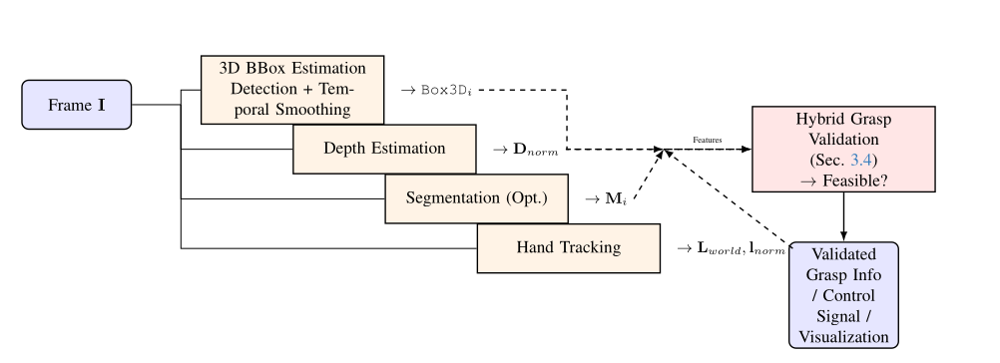

# Intelligent Prosthetic Arm: Vision-Guided Grasping

[](https://opensource.org/licenses/Apache-2.0)
[](https://hub.docker.com/r/vannileonardo/pipeline-server)
[]()


This project, developed in collaboration with the Bocconi AI and Neuroscience Student Association (BAINSA), aims to create an intelligent prosthetic arm controlled intuitively via EEG signals and guided by real-time visual understanding of the environment. This README focuses on the **Computer Vision pipeline**, a core component enabling the system to perceive objects, understand 3D space, track the user's hand, and validate grasp feasibility before execution.

---

## Overview

Imagine a prosthetic arm that doesn't just react, but *understands*. This project integrates **Neuroscience** (interpreting user intent from EEG), **Computer Vision** (analyzing the visual world), and **Robotics** (acting physically) to restore a significant degree of natural hand function. Our CV pipeline provides the crucial "eyes" for the system, enabling safer, more dexterous, and intuitive interaction with everyday objects.

  

---

## Key Features (CV Pipeline)

*   **Real-time Object Recognition:** Detects and tracks objects (e.g., bottles, cups) using YOLO models.
*   **Monocular Depth Perception:** Estimates scene depth from a single standard camera using DepthAnythingV2, providing 3D context.
*   **3D Object Pose & Size Estimation:** Generates oriented 3D bounding boxes for detected objects by fusing 2D detection with depth information.
*   **Temporal Smoothing:** Employs Kalman filtering to stabilize 3D object pose estimates over time, reducing jitter.
*   **Instance Segmentation (Optional):** Utilizes SAM2 to generate pixel-perfect masks for objects.
*   **Real-time Hand Tracking:** Leverages MediaPipe HandLandmarker to track the user's hand landmarks in 3D space.
*   **Hybrid Grasp Validation:** Intelligently assesses if a potential grasp is feasible by analyzing object geometry (size, orientation) *and* user hand pose (openness, proximity).
*   **Spatial Awareness:** Visualizes the 3D scene understanding through an intuitive XY View.
*   **Interactive GUI:** A comprehensive graphical interface demonstrates the entire pipeline processing stages in real-time.
*   **Modular & Extensible:** Designed with clear components, ready for integration with Neuroscience and Robotics modules via ROS2.

---

## Live Demo Showcase


https://github.com/user-attachments/assets/c49e658b-e2b3-4af0-97e4-ec45f0d9a6d6


---

## System Architecture (Conceptual)

The prosthetic system operates through a coordinated flow:

1.  **(Neuroscience)** EEG signals capture user intent (e.g., "grasp the bottle").
2.  **(Central Control - Planned: RPi + ROS2)** Intent is processed and relayed.
3.  **(Computer Vision)** Simultaneously, the CV pipeline analyzes the camera feed:
    *   Detects objects (YOLO).
    *   Estimates depth (DepthAnythingV2).
    *   Estimates 3D pose and size (BBox3DEstimator + Kalman).
    *   Tracks user hand (MediaPipe).
    *   *(Optional)* Segments objects (SAM2).
4.  **(Central Control)** Receives CV analysis (object locations, hand pose) and user intent.
5.  **(Grasp Validation - CV Module!)** Validates if the intended grasp is feasible based on the current scene understanding and hand state.
6.  **(Central Control)** If valid, generates low-level commands for the robotic arm.
7.  **(Robotics)** Executes the grasp action.
8.  **(Sensors - Planned)** Feedback (force, contact) refines the action.



---

## Technology Stack

*   **Programming Language:** Python 3.12+
*   **Core Libraries:** PyTorch, OpenCV, NumPy, MediaPipe, Ultralytics (YOLO), Transformers, FilterPy, PySide6 (GUI)
*   **Computer Vision Models:**
    *   Object Detection: YOLO (v5/v9/other variants) / RF-DETR
    *   Depth Estimation: DepthAnythingV2 (Small/Base/Large) / DepthPro
    *   Segmentation: Segment Anything Model 2 (SAM2)
    *   Hand Tracking: MediaPipe HandLandmarker
*   **Planned Integration:** ROS2 (Humble/Jazzy), Raspberry Pi (Controller)
*   **Development:** Docker, Conda

---

## Installation & Setup

You can run the Computer Vision pipeline demo using either Docker (for specific scripts, check Dockerfiles) or a local Python environment (recommended for the GUI).

**Prerequisites:**

*   Git
*   Python 3.12+
*   **For Local Setup:** `pip` and `venv` (or Conda)
*   **For Docker Setup:** Docker Engine installed
*   **(Recommended)** NVIDIA GPU with CUDA configured (see [CUDA Setup Guide](computer_vision/SETUP.md)) for significant performance gains.

---

### Option A: Local Setup (Recommended for GUI Demo)

1.  **Clone the Repository:**
    ```bash
    git clone https://github.com/VanniLeonardo/Prosthetic-Arm.git
    cd Prosthetic-Arm
    ```

2.  **Create and Activate Virtual Environment:**
    ```bash
    python3 -m venv venv_prosthetic
    # Linux/macOS:
    source venv_prosthetic/bin/activate
    # Windows:
    # venv_prosthetic\Scripts\activate
    ```

3.  **Install Dependencies:**
    ```bash
    # Install GUI and Core CV dependencies
    pip install -r GUI/requirements.txt 
    ```
    *   **CUDA-Accelerated PyTorch:** If you have a compatible NVIDIA GPU and set up CUDA (see [SETUP.md](computer_vision/SETUP.md)), ensure you install the correct PyTorch version:
        ```bash
        # Example for CUDA 12.1 (Check PyTorch website for your specific CUDA version)
        pip install torch torchvision torchaudio --index-url https://download.pytorch.org/whl/cu121
        ```

4.  **Download Models:**
    *   The necessary CV models need to be placed in the correct directories. At minimum:
        *   **Hand Landmark Model:** Download `hand_landmarker.task` (e.g., from [MediaPipe Models](https://developers.google.com/mediapipe/solutions/vision/hand_landmarker#models)) and place it in the GUI/models directory or update path.
        *   **YOLO/Depth/SAM:** These models are often downloaded automatically by the respective libraries (Ultralytics, Transformers) on first run, but ensure you have internet access. Check specific model classes (e.g., `detection_model.py`) if manual download is needed.

5.  **Hardware:** Connect a webcam recognized by your system (usually index 0).

---

### Option B: Docker Setup (Useful for Cloud GPUs)

1.  **Clone the Repository:**
    ```bash
    git clone https://github.com/VanniLeonardo/Prosthetic-Arm.git
    cd Prosthetic-Arm
    ```

2.  **Build the Docker Image (Example for `computer_vision`):**
    ```bash
    # Build the image
    docker build -t pipeline-server . 
    # or download it directly from DockerHub via
    # docker image pull vannileonardo/pipeline-server:latest
    ```

3.  **Run the Docker Container:**
    ```bash
    # Example: Run interactively, remove container on exit, mount camera device
    # Finding the correct camera device path (/dev/videoX) might vary.
    docker run -it --rm --gpus all --device=/dev/video0:/dev/video0 -p 8765:8765 pipeline-server
    # Add -v $(pwd):/app/dev for volume mounting if needed to access local files/models easily
    ```
    *   `--gpus all`: Enables GPU access inside the container (requires NVIDIA Container Toolkit).
    *   `--device`: Maps your host camera device into the container. 
    * `-p 8765:8765`: Maps port via TCP.
    * Refer to the [DockerHub link](https://hub.docker.com/r/vannileonardo/pipeline-server) for more pre-built images.

### **How to use (Docker option)**:
* This is most useful to be used via Cloud using dedicated CUDA-activated Virtual Machines (e.g. vast.ai)
* Simply activate the instance, look at IP address of the host machine and port mapping for 8765 (vast changes it).
* On your local computer run `GUI/GUI.py` (this doesn't require having models downloaded) and connect to the remote host.
* Run the pipeline and enjoy :D

---

## Usage (Running the GUI Demo)

After completing the **Local Setup**:

1.  Make sure your virtual environment is activated.
2.  Navigate to the project's root directory.
3.  Run the application in 2 terminals:
    ```bash
    python GUI/pipeline_server.py
    ```
    ```bash
    python GUI/GUI.py
    ```

4.  **Using the GUI:**
    *   Select the video source (camera index like `0` or path to a video file).
    *   Configure model sizes and features using the control panel.
    *   Click "**Start Pipeline**".
    *   Observe the different video feeds showing detection, segmentation (if enabled), depth, and the combined view with 3D boxes, hand tracking, and grasp validation status.

---

## Project Structure
```
vannileonardo-prosthetic-arm/
├── GUI/ # Real-time CV Pipeline GUI & Core Logic
│ ├── app.py # Core pipeline orchestration logic
│ ├── GUI.py # PySide6 GUI application
│ └── ... (model handlers, utils)
├── computer_vision/ # Standalone CV scripts & experiments (may overlap with GUI)
│ ├── scripts/
│ │ ├── main.py # Example main script (non-GUI)
│ │ └── ... (grasp validation, detection, etc.)
│ ├── Dockerfile # Dockerfile for this specific CV module
│ └── README.md
├── docker/ # Docker setup potentially for ROS/integration
│ └── Dockerfile
├── neuroscience/ # Placeholder for EEG processing module
├── robotics/ # Placeholder for Arm control module
├── hand_landmarker.task # Default hand model file
├── README.md # This file
└── LICENSE
```

---

## Current Status & Roadmap

Development is ongoing. The Computer Vision pipeline is functional and demonstrated via the GUI. Integration with Neuroscience and Robotics components is the next major phase.

    ✅ = Completed, ⏳ = In Progress, ⬜ = Planned

    ✅ Computer Vision:
        ✅ Object Detection (YOLO)
        ✅ Depth Estimation (DepthAnythingV2)
        ✅ Segmentation (SAM2)
        ✅ Hand Landmark Tracking (MediaPipe)
        ✅ 3D Bounding Box Estimation & Visualization (w/ Kalman Filtering)
        ✅ Geometric & Hybrid Grasp Validation Logic
        ✅ Interactive GUI Demonstrator
        ⬜ Advanced Grasp Planning (How to grasp optimally)
        ⬜ Learned Grasp Validation Models

    ⏳ Neuroscience: (External Component)
        ⏳ EEG Signal Acquisition & Processing
        ⏳ Intent Recognition Model Training

    ⏳ Robotics: (External Component)
        ⏳ Custom Arm Hardware & Control Interface
        ⬜ ROS2 Integration Layer
        ⬜ Motion Planning & Execution

    ⬜ System Integration:
        ⬜ ROS2 Communication Backbone Setup
        ⬜ Central Control Logic (Raspberry Pi)
        ⬜ Full End-to-End System Testing

---

## Contributors

*   **Leonardo Vanni** (Project Lead, CV Lead) - [Email](mailto:leonardo.vanni@studbocconi.it)
*   **Anna Notaro** (Neuroscience Lead) - [Email](mailto:anna.notaro@studbocconi.it)
*   **Ayan Beisenbek** (Computer Vision Team) - [Email](mailto:ayan.beisenbek@studbocconi.it)
*   **Hugo Arsenio** (Robotics Team) - [Email](mailto:hugo.arsenio@studbocconi.it)
*   **Dan Anghel** (Robotics Team) - [Email](mailto:dan.anghel@studbocconi.it)
*   **Giovanni Nocerino** (Neuroscience Team) - [Email](mailto:giovanni.nocerino@studbocconi.it)


---

## License

This project is licensed under the Apache License 2.0. See the [LICENSE](LICENSE) file for details.
